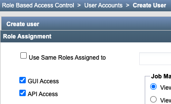
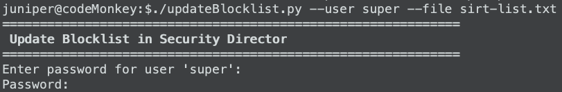
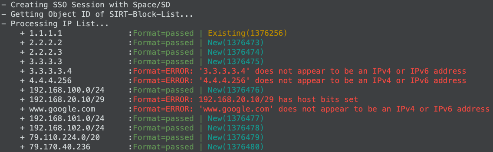
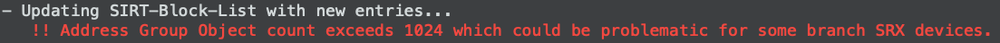
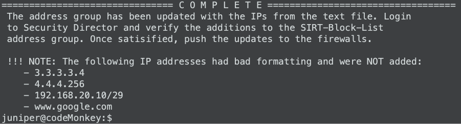
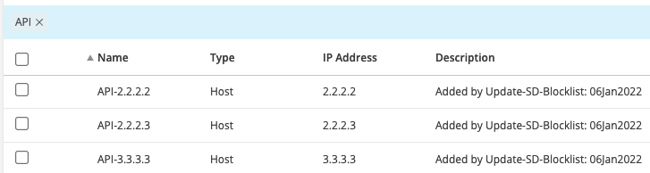
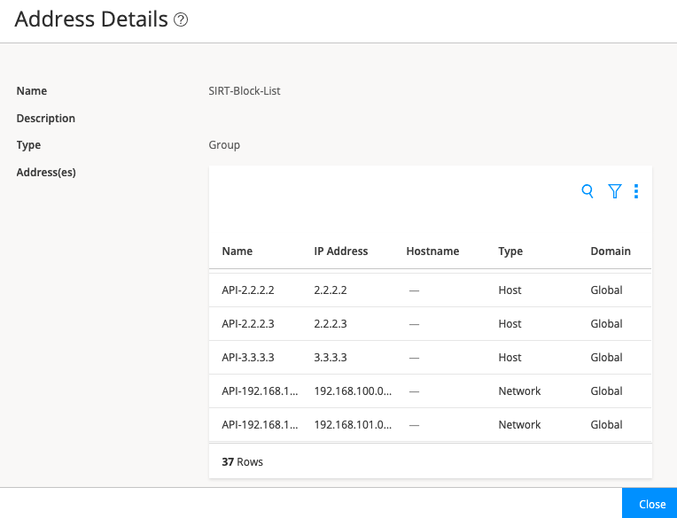

# Update SD Blocklist

## Purpose
Maintaining security feeds is easily accomplished with Juniper Policy Enforcer or SecIntel but not all customers can utilize those products/services. This script is for customers that are managing firewalls with Security Director and need an easy way to add a list of IP addresses & subnets to an existing Security Group for bulk block requests.

## Background
This script uses Python3 to leverage the Space/Security Director REST API to add IPv4 address objects to and existing address group. Security Director supports both IPv4 & IPv6 and hostnames address objects but this script only supports IPv4 addresses & subnets.

The script was developed and tested using:
- Ubuntu 18.04 & 20.04 but should work on other Linux flavors.
- Security Director 20.1R1 & 20.3R1 but should work on other versions

## Space/SD Requirements
1. Within Space Network Management Platform, have or create a user account with API access
   - 
   - :thumbsdown: Using the 'super' account is NOT recommended in production environments.
2. Existing address group
    See [References section](https://github.com/jweidley/Update-SD-Blocklist#references) below for a link to the documentation.
3. Address group applied to a security policy 

## Automation Host Setup
1. Ensure Python3 is installed

2. Install required python3 modules
```
    pip3 install -r requirements.txt
```

3. [updateBlocklist.py](updateBlocklist.py) Variable Modifications
    - **spaceURL**: Is the IP address or hostname of the Space/SD server
    - **AddressGroupName**: Is the name of an existing address-group in SD that new address objects will be added to

```
    ##############################
    # Variables
    ##############################
    spaceURL = "https://192.168.1.100"
    AddressGroupName = "SIRT-Block-List"
    # --------- dont modify any below -------------
```

## Blocklist File Formatting

The blocklist is a simple text file with 1 entry per line:
- Comment character (#) is ignored
- Each line MUST be either:
  - a valid IPv4 host address (i.e 1.1.1.1) 
  - a valid IPv4 subnet (i.e. 192.168.1.0/24)

A sample blocklist file [sirt-list.txt](sirt-list.txt) is included in the repo and shows the different address formats. There are a few incorrectly formatted entries to demonstrate the modules ability to detect & display errors.

```
##########################
# SIRT Block List
##########################
1.1.1.1
2.2.2.2
2.2.2.3
192.168.100.0/24
172.16.101.0/24
```

### About IP address Validation
The entries in the blocklist file are checked for formatting by the Python ipaddress module. It may be possible for a specific entry to pass the ipaddress module validation but fail the Security Director validation. In those rare situations, verify the correct formatting in Security Director when manually creating the entry and use that formatting in the blocklist file.


--------------------------------------------------------------------------
# Running updateBlockList.py
The script **REQUIRES** two command line options: 
```
./updateBlocklist.py --user super --file sirt-list.txt
```

Option   | Short | Long   | Description
---------|-------|--------|----------------------------------------------------------
Username | -u    | --user | This is the user account that will be used to login to Security Director.
Filename | -f    | --file | This is the text file with the list of IPv4 addresses/subnets.

Next you are prompted for the password of the user. 


--------------------------------------------------------------------------
# Under the Covers
1. The script authenticates using the REST API and cookies are used for all additional communication with SD. 

2. The first thing the script does is gets the existing address objects in the supplied Address Group ('**SIRT-Block-List**' by default). 

3. The blocklist file is processed with each entry being printed to the screen with additional information. 
   - The IP address/subnet is validated using the Python ipaddress module
     - If the formatting is correct a "**Format=passed**" message is printed. 
     - If there are errors in the formatting, "**Format=ERROR**" is displayed with a descriptive message or the error.

   - Checks to see if there is already an existing address object for that address/subnet. From the screenshot, you can see that:
     - There is an **Existing** address object for 1.1.1.1 with an internal database ID of 1376256. 
     - There is not an existing address object for 2.2.2.2 so a **New** address object is created using the [add_address.j2](add_address.j2) JSON template and the internal database ID is 1376473.


4. After all of the entries have been processed the address group will be updated
   - The address group is updated using the [modify_address_group.j2](modify_address_group.j2) JSON template
   - :warning: Branch SRX devices are limited in the number of address objects that can be in a single address group. The script counts the number of entries in the address group and prints the following error if it exceeds 1023.


5. A "Complete" message is printed at the bottom to remind you to review the additions to the address group in Security Director and that devices need to be manually updated to receive the changes.  
   - If there were any IP address formatting problems while processing the blocklist, a summary of errors is printed at the end.


6. Verify changes in Security Director:
   - Address objects are created with a prefix of "API-" to make them easily searchable
   - The Description field is populated with the name of this script as well as the date it was created
   
   - The new objects are also added to the address group
   

7. Follow the normal process for deploying the changes to the firewalls

--------------------------------------------------------------------------
# Searching Object Descriptions
It would be very useful to be able to search the "Description" fields of address objects, but unfortunately Security Director doesn't currently have this functionality. As a workaround, this repo includes [sd-searchDescription.py](sd-searchDescription.py) that allows for simplistic searches for text located in the description field of all address objects.

## Running sd-searchDescription.py
Like updateBlockList.py, this script also **REQUIRES** two command line options: 
```
./sd-searchDescription.py --user super --search 06jan
```

Option   | Short | Long     | Description
---------|-------|----------|----------------------------------------------------------
Username | -u    | --user   | This is the user account that will be used to login to Security Director.
Search   | -s    | --search | The search string to look for in the description field.

### Sample Output
```
==================================================================
 Security Director: Search Address Object Descriptions Fields
==================================================================
Enter password for user 'super': 
Password: 
=====================================================
 The following objects contain a description of '06jan'
=====================================================
API-2.2.2.2
API-2.2.2.3
API-3.3.3.3
API-192.168.100.0/24
```

--------------------------------------------------------------------------
## References
1. [Junos Space RESTful API Reference for Security Director 20.1R1](https://www.juniper.net/documentation/en_US/junos-space21.2/information-products/api-ref/security-director-rest-api-21.2r1.pdf)

2. [Junos Space Creating User Accounts](https://www.juniper.net/documentation/en_US/junos-space21.1/platform/topics/task/configuration/junos-space-user-accounts-creating.html)

3. [Security Director: Address & Address Groups](https://www.juniper.net/documentation/en_US/junos-space20.1/topics/task/operational/junos-space-addresse-address-group-creating.html)


